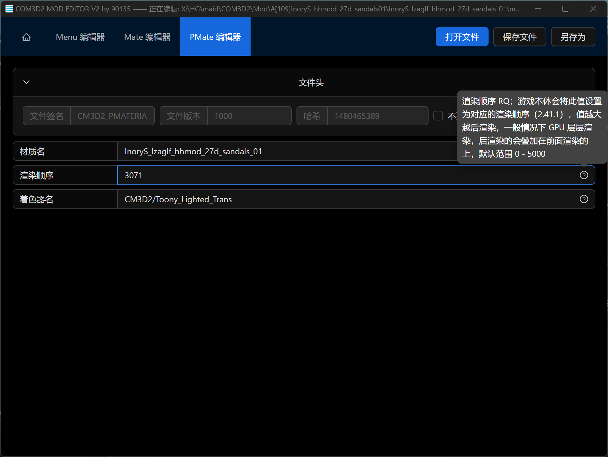
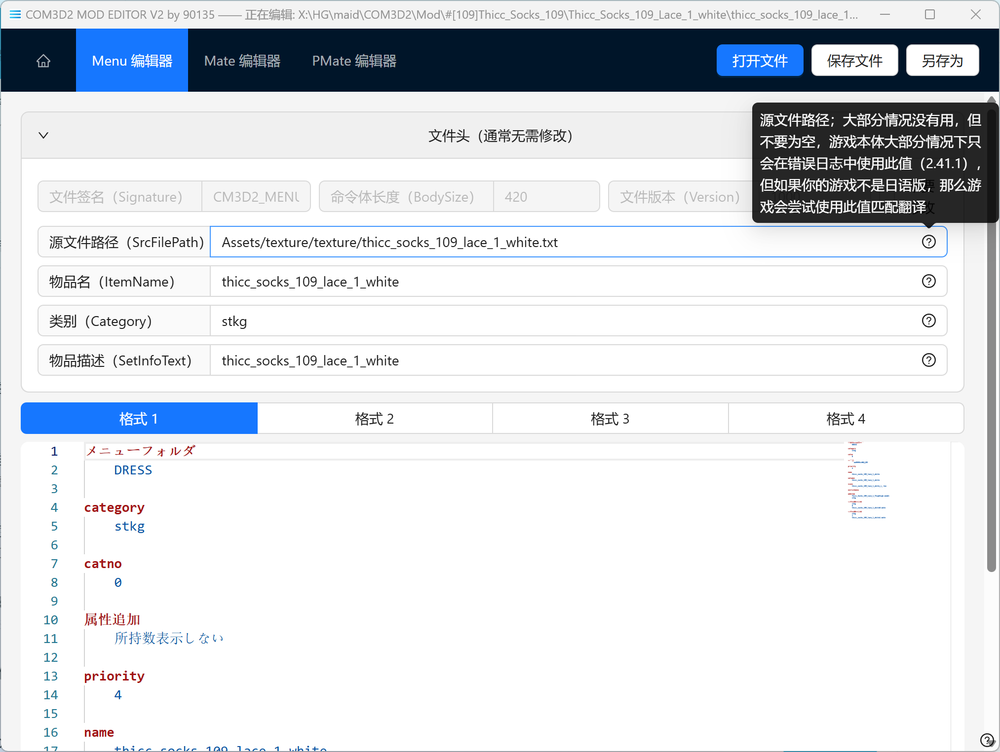
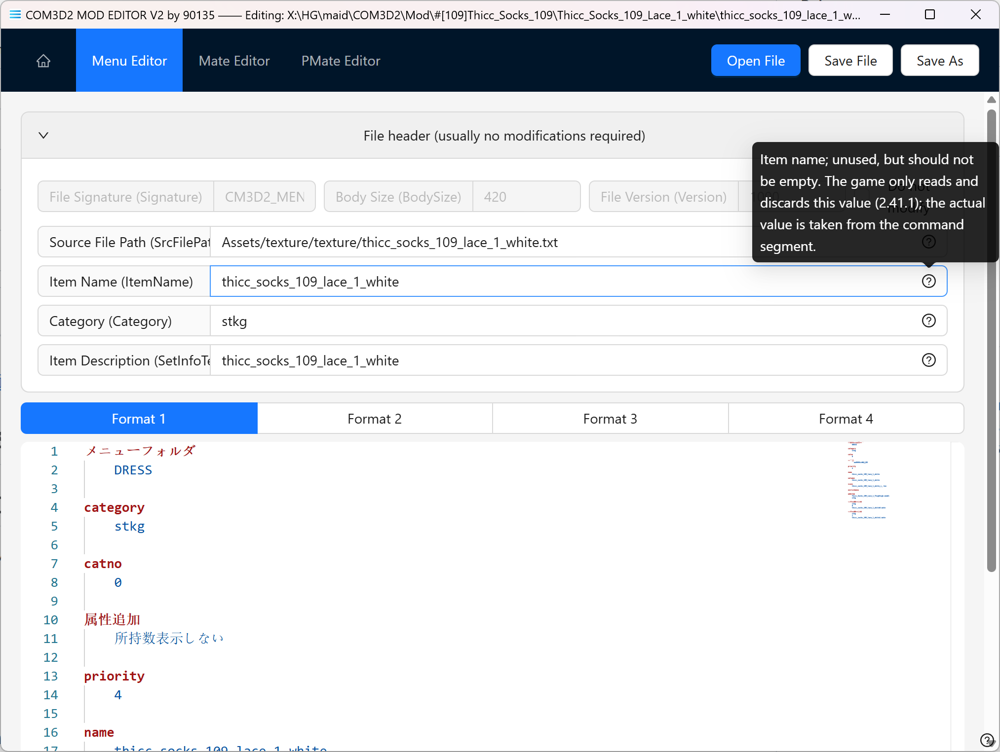
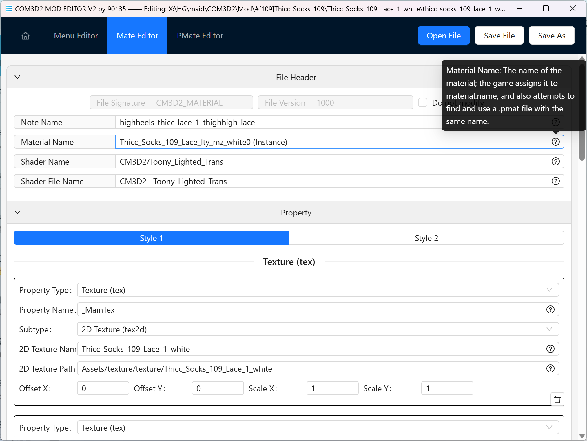
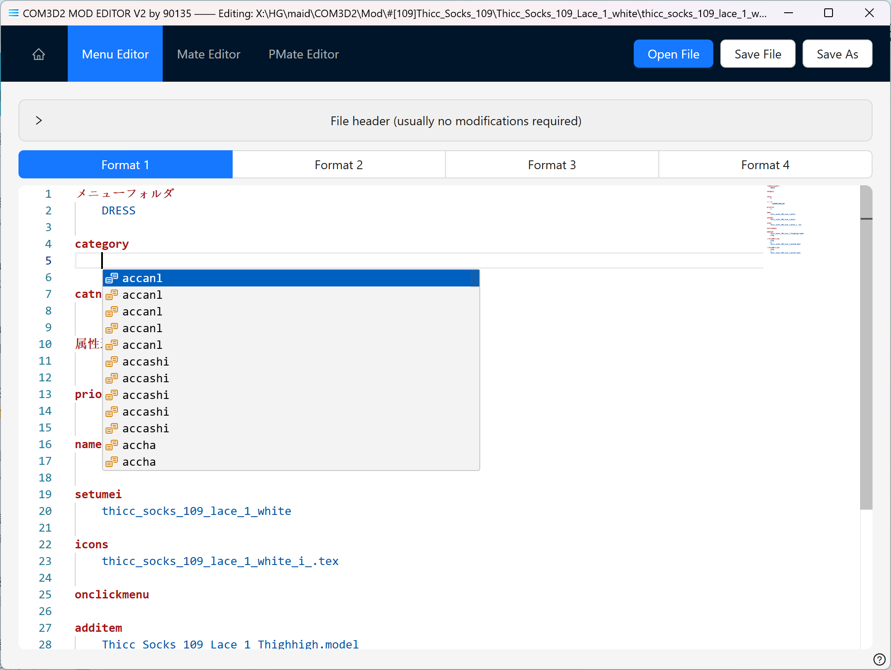
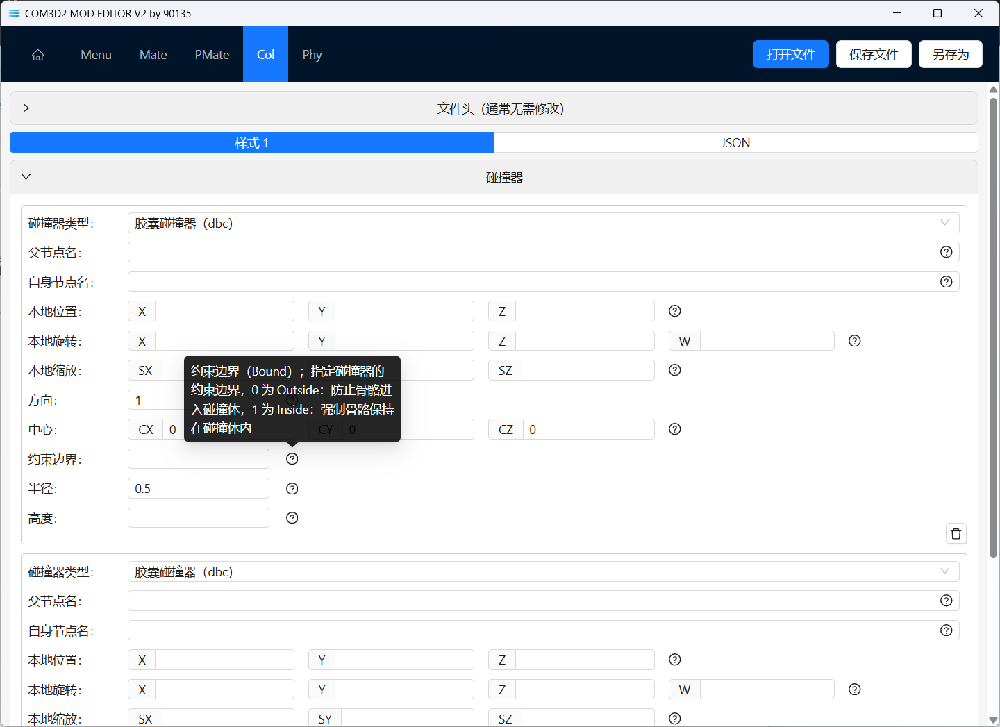
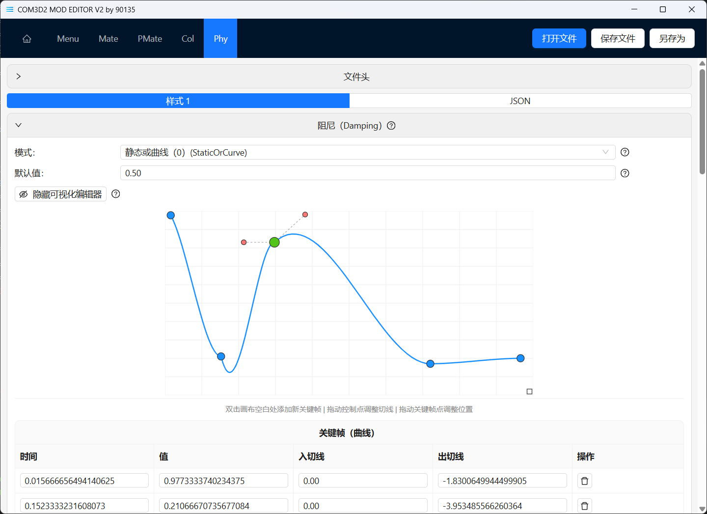

[English](#english) | [简体中文](#%E7%AE%80%E4%BD%93%E4%B8%AD%E6%96%87) | [日本語](#%E6%97%A5%E6%9C%AC%E8%AA%9E)

[]()

# English

## COM3D2 MOD EDITOR V2

COM3D2 MOD editor, built with Golang + Wails + React + TypeScript, Modern technology here we come!!

<br>

This is a MOD creation tool for [カスタムオーダーメイド3D 2](https://com3d2.jp/) (CUSTOM ORDER MAID 3D2 / COM3D2)

But it can also be used for [カスタムメイド3D 2](https://www.kisskiss.tv/kiss/) (CUSTOM MAID 3D2 / CM3D2)

<br>

If you like it, please light up the Star~

Any Bug or request, plsease use Issues or Discussions

or join Discord [https://discord.gg/XQVfcJWbPp](https://discord.gg/XQVfcJWbPp)

<br>

For now, it allows you to edit files in these formats

- `.menu`
- `.mate`
- `.pmat`
- `.col`
- `.phy`
- `.psk`
- `.tex` (preview & convert only & requires external dependencies)
- `.anm` (JSON only)

### Highlights

- Fully open source, completely free, and completely free; say goodbye to non-open source non-free software.
- With full multilingual support, please contribute to us through [Crowdin](https://crowdin.com/project/com3d2modeditorv2)!
- With complete entry help, don’t know what to fill in the box? You are in the right place!
- Ability to create files from scratch, no need to copy files from elsewhere.
- With light mode and dark mode.
- .menu editing syntax highlighting.
- All-in-one.
- More benefits are waiting for you to discover.

### Requirements

This application requires the following software to run:
- Microsoft Edge WebView2
  - This app is built using the Wails framework which relies on Microsoft Edge WebView2 to render the UI.
  - If you're using Windows 11, this is usually pre-installed on your system.
  - For other systems without WebView2 installed，the application should prompt you to install it upon launch.
  - Alternatively, you can install it from the official website: https://developer.microsoft.com/en-us/microsoft-edge/webview2/
  - What is Microsoft Edge WebView2? [https://learn.microsoft.com/en-us/microsoft-edge/webview2/](https://learn.microsoft.com/en-us/microsoft-edge/webview2/)
- ImageMagick
  - Required for working with .tex files and image processing features to support various image formats. Optional if you don't need .tex editing.
  - Install from the official website: [https://imagemagick.org/script/download.php](https://crowdin.com/project/com3d2modeditorv2)
  - On the download page, look for `ImageMagick-version-Q16-HDRI-x64-dll.exe` and install it. During installation, check `Add application directory to your system path`.
  - Or install via terminal command: `winget install ImageMagick.Q16-HDRI`
  - After installation, verify by running `magick -version` in your terminal. A version number output indicates success.
  - ImageMagick® is a free and open-source software suite for image editing and manipulation.

### Localization

[](https://crowdin.com/project/com3d2modeditorv2)

We use Crowdin for localization, and we will synchronize translations with Crowdin at each release.

If you want to participate in localization, please check [https://crowdin.com/project/com3d2modeditorv2](https://crowdin.com/project/com3d2modeditorv2)

register a free account and you can contribute translations on Crowdin.

Currently, some languages use AI translation. If you are not satisfied with the existing translations, please feel free to contribute translations through Crowdin.


### Privacy

This application does not collect any personal information nor upload any data to servers.

The only active network request is for update checks, which solely communicates with GitHub API. You can disable the update check feature.

Code location: https://github.com/90135/COM3D2_MOD_EDITOR/blob/c2ea8d4bf2ea42c3b28b929ce7c118eac33cad20/app.go#L127


<br>

Maybe also check out my MOD Making Tutorial (in Chinese): [https://github.com/90135/COM3D2_Simple_MOD_Guide_Chinese](https://github.com/90135/COM3D2_Simple_MOD_Guide_Chinese)

<br>

| ScreenShot                | ScreenShot                | ScreenShot                | ScreenShot                |
|---------------------------|---------------------------|---------------------------|---------------------------|
|  |  |  |  |
|  |  |  |  |

<br>
<br>
<br>
<br>

# 简体中文

## COM3D2 MOD EDITOR V2

COM3D2 MOD 编辑器，使用 Golang + Wails + React + TypeScript 打造，现代技术我们来了！！

<br>

这是 [カスタムオーダーメイド3D2](https://com3d2.jp/) (CUSTOM ORDER MAID 3D2 / COM3D2) 的 MOD 制作工具

但它也可以用于 [カスタムメイド3D 2](https://www.kisskiss.tv/kiss/) (CUSTOM MAID 3D2 / CM3D2)

<br>

如果您喜欢，请点亮 Star~

任何 Bug 或请求，请使用 Issues 或 Discussions

或

QQ 群 967954608 加群暗号 MOD

Discord [https://discord.gg/XQVfcJWbPp](https://discord.gg/XQVfcJWbPp)

<br>

目前，它允许您编辑以下格式的文件

- `.menu`
- `.mate`
- `.pmat`
- `.col`
- `.phy`
- `.psk`
- `.tex` (仅支持预览和转换、需要外部依赖)
- `.anm` (仅 JSON 格式)

### 亮点

- 完全开源，完全免费，完全自由；和非开源的非自由软件说再见。
- 拥有完整的多国语言支持，请通过 [Crowdin](https://crowdin.com/project/com3d2modeditorv2) 为我们贡献翻译！
- 拥有完整的条目帮助，不知道框内该填什么？你来对地方了！
- 有能力从 0 创建文件，告别需要从别处复制文件。
- 拥有浅色模式和暗黑模式。
- .menu 编辑语法高亮。
- 多合一。
- 更多好处等你来发现！

### 依赖

该应用需要以下软件以运行：
- Microsoft Edge WebView2
  - 本应用使用 Wails 技术打造，它依赖于 Microsoft Edge WebView2 来渲染页面，因此需要安装 WebView2。
  - 如果你使用 Windows 11，这通常已经安装在你的系统上了。
  - 如果你使用其他系统，且没有安装 WebView2，启动应用程序时它应该会提示您安装。
  - 或者您也可以从官方网站安装：[https://developer.microsoft.com/zh-cn/microsoft-edge/webview2](https://learn.microsoft.com/ja-jp/microsoft-edge/webview2/)
  - Microsoft Edge WebView2 是什么？[https://learn.microsoft.com/zh-cn/microsoft-edge/webview2/](https://learn.microsoft.com/zh-cn/microsoft-edge/webview2/)
- ImageMagick
  - 使用 .tex 格式和图片处理相关功能需要安装 ImageMagick，这是为了支持尽可能多的图片格式。如果您不使用 .tex 编辑，您可以选择不安装。
  - 请从官方网站安装：[https://imagemagick.org/script/download.php](https://learn.microsoft.com/zh-cn/microsoft-edge/webview2/)
  - 在下载页面上找到 `ImageMagick-版本号-Q16-HDRI-x64-dll.exe` 下载并安装，安装时需要勾选 `Add application directory to your system path`
  - 或者在您的终端执行 `winget install ImageMagick.Q16-HDRI` 命令安装。
  - 安装完成后在终端执行 `magick -version` 命令查看版本号，如果显示版本号则说明安装成功。
  - ImageMagick® 是一个自由的开源软件套件，用于编辑和操纵数字图像。

### 本地化

[](https://crowdin.com/project/com3d2modeditorv2)

我们使用 Crowdin 进行本地化，在每个版本发布时我们会从 Crowdin 同步翻译。

如果您想参与本地化，请访问 [https://crowdin.com/project/com3d2modeditorv2](https://crowdin.com/project/com3d2modeditorv2)

注册一个免费账户后，您就可以在 Crowdin 上为我们贡献翻译。

目前部分语言使用 AI 翻译，如果您对现有翻译不满意，请随时贡献翻译。

### 隐私

本应用不会收集任何个人信息，也不会上传任何信息到任何服务器。

唯一的主动网络请求是用于检查更新，它只会请求 Github API，您也可以关闭更新检查功能。

代码位于 https://github.com/90135/COM3D2_MOD_EDITOR/blob/c2ea8d4bf2ea42c3b28b929ce7c118eac33cad20/app.go#L127

<br>

也许也可以看看我的 MOD 制作教程（中文）：[https://github.com/90135/COM3D2_Simple_MOD_Guide_Chinese](https://github.com/90135/COM3D2_Simple_MOD_Guide_Chinese)

<br>

| 截图                        | 截图                        | 截图                        | 截图                        |
|---------------------------|---------------------------|---------------------------|---------------------------|
|  |  |  |  |
|  |  |  |  |

<br>
<br>
<br>
<br>

# 日本語

## COM3D2 MOD EDITOR V2

AI Translation

COM3D2 MOD エディターは、Golang + Wails + React + TypeScript を使用して開発されました。最新技術で新たな時代へ！！

<br>

[カスタムオーダーメイド3D2](https://com3d2.jp/)(CUSTOM ORDER MAID 3D2 / COM3D2)用のMOD作成ツールです。

ただし、[カスタムメイド3D 2](https://www.kisskiss.tv/kiss/)(CUSTOM MAID 3D2 / CM3D2)でも使用できます。

<br>

気に入っていただけたら「Star」ボタンを点灯してくださいね〜

バグやリクエストがある場合は、Issues または Discussions をご利用ください

または Discord [https://discord.gg/XQVfcJWbPp](https://discord.gg/XQVfcJWbPp) に参加してください

<br>

現在、以下の形式のファイルを編集することができます。

- `.menu`
- `.mate`
- `.pmat`
- `.col`
- `.phy`
- `.psk`
- `.tex` (プレビューと変換のみサポート、外部依存関係が必要)
- `.anm` (JSONフォーマットのみ)

### ハイライト

- 完全にオープンソース、完全に無料、そして完全にフリー。オープンソースではない、フリーではないソフトウェアとはお別れです。
- 完全な多言語サポートを備えており、Crowdinを通じて翻訳にご協力ください！
- 完全な入力ヘルプがありますが、ボックスに何を入力すればよいかわかりませんか?あなたは正しい場所に来ました！
- 最初からファイルを作成する機能。他の場所からファイルをコピーする必要はありません。
- ファイルのドラッグとファイルとして開くことをサポート
- ライトモードとダークモードがあります。
- .menu 編集構文の強調表示。
- オールインワン。
- さらに多くのメリットがあなたを待っています

### 必要なソフトウェア

本アプリケーションの実行には以下のソフトウェアが必要です：
- Microsoft Edge WebView2
  - 本アプリはWailsフレームワークを使用しており、UIのレンダリングにMicrosoft Edge WebView2を必要とします
  - Windows 11をご利用の場合、通常はプリインストールされています
  - 他のOSを使用している場合、WebView2が未インストールの状態でアプリを起動するとインストールプロンプトが表示されます
  - 公式サイトから手動でインストールすることも可能です：[https://developer.microsoft.com/ja-jp/microsoft-edge/webview2/](https://learn.microsoft.com/zh-cn/microsoft-edge/webview2/)
  - Microsoft Edge WebView2とは？[https://learn.microsoft.com/ja-jp/microsoft-edge/webview2/](https://learn.microsoft.com/ja-jp/microsoft-edge/webview2/)
- ImageMagick
  - .texファイルの編集および画像処理機能を使用する場合に必要です。.tex編集が不要な場合はインストール不要です
  - 公式サイトからインストールしてください：[https://imagemagick.org/script/download.php](https://learn.microsoft.com/ja-jp/microsoft-edge/webview2/)
  - ダウンロードページで`ImageMagick-バージョン-Q16-HDRI-x64-dll.exe`を選択し、インストール時に`Add application directory to your system path（システムパスに追加）`にチェックを入れてください
  - またはターミナルで次のコマンドを実行：`winget install ImageMagick.Q16-HDRI`
  - インストール後、ターミナルで`magick -version`を実行し、バージョン番号が表示されれば成功です
  - ImageMagick® は画像編集・加工用のオープンソースソフトウェアスイートです

### ローカライゼーション

[](https://crowdin.com/project/com3d2modeditorv2)

私たちはCrowdinを使用してローカライゼーションを行っており、各バージョンのリリース時に[Crowdin](https://crowdin.com/project/com3d2modeditorv2)から翻訳を同期します。

ローカライゼーションに参加したい場合は、[https://crowdin.com/project/com3d2modeditorv2](https://crowdin.com/project/com3d2modeditorv2) をご覧ください。

無料アカウントを登録すれば、Crowdin上で翻訳に貢献することができます。

現在、一部の言語ではAI翻訳を使用しています。既存の翻訳に満足できない場合は、いつでも翻訳を提供してください。

### プライバシー

本アプリは個人情報を一切収集せず、いかなる情報もサーバーにアップロードすることはありません。

唯一の能動的なネットワークリクエストは更新チェック用で、GitHub API のみにリクエストを送信します。更新チェック機能を無効にすることも可能です。

該当コード: https://github.com/90135/COM3D2_MOD_EDITOR/blob/c2ea8d4bf2ea42c3b28b929ce7c118eac33cad20/app.go#L127

<br>

また、私の MOD 制作チュートリアル（中国語）もぜひご覧ください：[https://github.com/90135/COM3D2_Simple_MOD_Guide_Chinese](https://github.com/90135/COM3D2_Simple_MOD_Guide_Chinese)

<br>

| SS                        | SS                        | SS                        | SS                        |
|---------------------------|---------------------------|---------------------------|---------------------------|
|  |  |  |  |
|  |  |  |  |

<br>
<br>
<br>
<br>
<br>
<br>
<br>
<br>

# How to Dev

1. clone this repo
2. install [Golang](https://go.dev/)  1.24+
3. run `go install github.com/wailsapp/wails/v2/cmd/wails@latest`
4. install [Nodejs](https://nodejs.org/) v22
5. install Pnpm `npm install -g pnpm@latest-10`

- run `wails dev` in project root to run in dev mode
- run `wails build` in project root to build project
- press `Ctrl + Shift + F12` Open Browser console

<br>
<br>

# KISS Rule

*This Project is not owned or endorsed by KISS.

*MODs are not supported by KISS.

*KISS cannot be held responsible for any problems that may arise when using MODs.

*If any problem occurs, please do not contact KISS.


```
KISS 規約

・原作がMOD作成者にある場合、又は、原作が「カスタムメイド3D2」のみに存在する内部データの場合、又は、原作が「カスタムメイド3D2」と「カスタムオーダーメイド3D2」の両方に存在する内部データの場合。
※MODはKISSサポート対象外です。
※MODを利用するに当たり、問題が発生してもKISSは一切の責任を負いかねます。
※「カスタムメイド3D2」か「カスタムオーダーメイド3D2」か「CR EditSystem」を購入されている方のみが利用できます。
※「カスタムメイド3D2」か「カスタムオーダーメイド3D2」か「CR EditSystem」上で表示する目的以外の利用は禁止します。
※これらの事項は https://kisskiss.tv/kiss/diary.php?no=558 を優先します。

・原作が「カスタムオーダーメイド3D2(GP01含む)」の内部データのみにある場合。
※MODはKISSサポート対象外です。
※MODを利用するに当たり、問題が発生してもKISSは一切の責任を負いかねます。
※「カスタムオーダーメイド3D2」か「CR EditSystem」をを購入されている方のみが利用できます。
※「カスタムオーダーメイド3D2」か「CR EditSystem」上で表示する目的以外の利用は禁止します。
※「カスタムメイド3D2」上では利用しないで下さい。
※これらの事項は https://kisskiss.tv/kiss/diary.php?no=558 を優先します。

・原作が「CR EditSystem」の内部データのみにある場合。
※MODはKISSサポート対象外です。
※MODを利用するに当たり、問題が発生してもKISSは一切の責任を負いかねます。
※「CR EditSystem」を購入されている方のみが利用できます。
※「CR EditSystem」上で表示する目的以外の利用は禁止します。
※「カスタムメイド3D2」「カスタムオーダーメイド3D2」上では利用しないで下さい。
※これらの事項は https://kisskiss.tv/kiss/diary.php?no=558 を優先します。
```
<br>
<br>

# Credit

- [CM3D2.Serialization](https://github.com/luvoid/CM3D2.Serialization) (I got some file structure information from here)
- [Golang](https://golang.org/)
- [Wails](https://wails.io/)
- [React](https://reactjs.org/)
- [TypeScript](https://www.typescriptlang.org/)
- [Ant Design](https://ant.design/)
- [Monaco Editor](https://microsoft.github.io/monaco-editor/)
- [ImageMagick](https://imagemagick.org/) by ImageMagick Studio LLC
